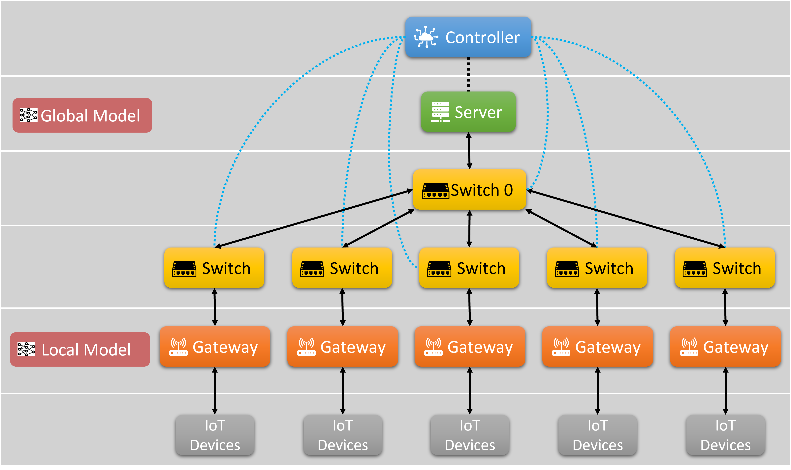

## SDN-based Federated Learning System for Detecting DDoS on IoT
### CSCI 6709 - Software Defined Networking, Dalhousie University.
#### Han Yang, Nathanael Bowley, Hongwei Zhang, Raham Moghaddam, Ehssan Mousavipour

> System Architecture:  
> 

> Abstract:  
Our system has three main components: the controller, switch, and security gateway. The controller takes responsibility for network management and acts as the model parameter aggregation server on the FL. The switch is responsible for communication and will maintain a flow table for routing. The security gateway is the network's access point, which will store the traffic data for IoT devices connected to it and train localized ML models based on saved data. Lastly, the gateway will retrieve an updated global model from the controller and then use it to monitor the communication traffic of the connected device. The controller will inject flow rules on the switch when traffic arrives, and will pass them to the security gateway for attack detection.

> Dataset:
[N-BaIoT Dataset to Detect IoT Botnet Attacks](https://www.kaggle.com/datasets/mkashifn/nbaiot-dataset)

> Instructions:
> The following instructions you need to take to run the Demo:
> 1. Downloading the "processedDataset" and make it under a folder named "dataset"
> 2. Open two terminals, one for the controller, and another for mininet
> 3. Terminal1 Go to the path /Desktop/ryu/bin, run command: 
> ```commandline
> python3.8 ryu-manager --observe-links <Path of controller>/controller.py
> ```
> 4. Terminal2 go to the path ./src, run command:
> ```commandline
> sudo -E mn --custom myTopo.py --topo create_topo --switch ovs --controller=remote --arp --mac
> ```
> 5. In mininet, call xterm h1, xterm h2, xterm h3 to access three hosts
> 6. Under host2, go to folder server, run (To enbale the aggregrator): 
> ```commandline
> python3 server1.py 
> ```
> 7. Under host1 go to folder client, run (To enbale the worker1):
> ```commandline
> python3 client1.py
> ```
> 8. Under host3 go to folder client, run (To enbale the worker2): 
> ```commandline
> python3 client2.py
> ```

> [Proposal](CSCI6709_Project/Resources/Proposal.pdf)